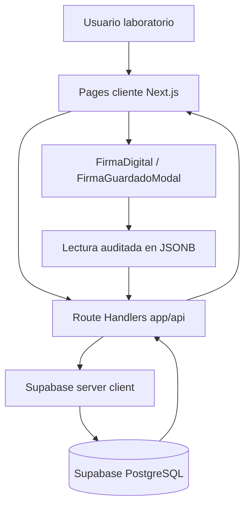
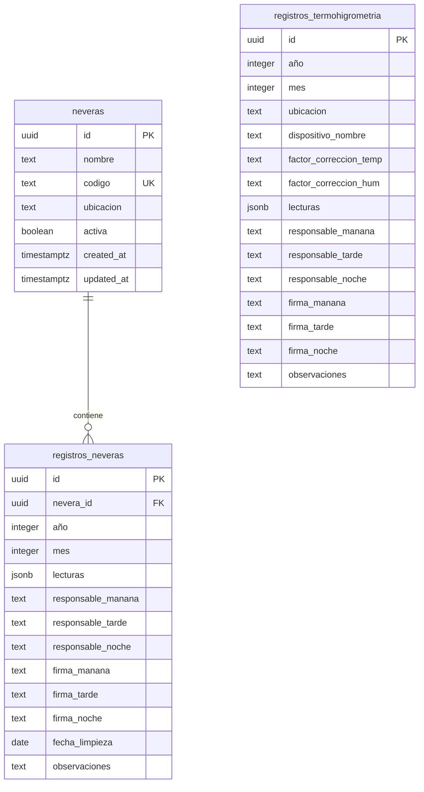
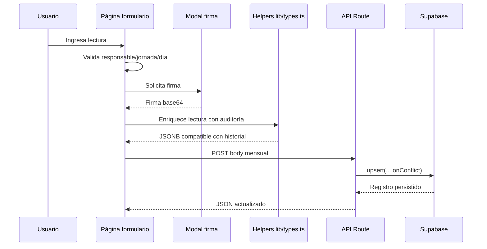

# Arquitectura — Lab Forms HSA

Sistema web para registros de laboratorio de la **E.S.E. Hospital San Antonio de Chía**. El producto digitaliza formularios operativos con trazabilidad por jornada, firma digital y persistencia en Supabase.

## Stack y convenciones

- **Next.js 16.2.4** con App Router (`app/`) y Route Handlers (`app/api/**/route.ts`).
- **React 19** con componentes cliente para formularios interactivos (`"use client"`).
- **TypeScript strict** (`strict: true`, `noEmit: true`, alias `@/*`).
- **Tailwind CSS 3.4.1** para estilos utilitarios.
- **Supabase** con `@supabase/ssr` y `@supabase/supabase-js` para PostgreSQL remoto.
- Deploy esperado en **Vercel**.

> Nota: el README menciona Next.js 15, pero `package.json` declara `next@^16.2.4`. Para cambios técnicos, tomá `package.json` como fuente efectiva.

## Módulos funcionales

### Dashboard

- `app/page.tsx`: entrada principal y navegación hacia formularios.
- `components/Navbar.tsx`, `HospitalHeader.tsx`, `HospitalFooter.tsx`, `HospitalLogo.tsx`: estructura institucional común.

### F-021 Termohigrometría

- UI: `app/termohigrometria/page.tsx`.
- API: `app/api/termohigrometria/route.ts`.
- Tabla: `registros_termohigrometria`.
- Un registro por `año + mes`.
- Captura temperatura y humedad por día/jornada (`M`, `T`, `N`) dentro de `lecturas` JSONB.
- Maneja responsables y firmas por jornada: `responsable_manana/tarde/noche`, `firma_manana/tarde/noche`.
- Tiene compatibilidad legacy con `factor_correccion`, `responsable` y `firma`.

### F-029 Neveras / Cadena de frío

- Gestión de neveras: `app/neveras/page.tsx`.
- Registro mensual: `app/neveras/registro/page.tsx`.
- APIs:
  - `app/api/neveras/route.ts`: listar/crear neveras.
  - `app/api/neveras/[id]/route.ts`: actualizar/eliminar nevera.
  - `app/api/neveras-registros/route.ts`: listar/upsert de registros mensuales.
- Tablas: `neveras`, `registros_neveras`.
- Un registro por `nevera_id + año + mes`.
- `lecturas` JSONB guarda temperaturas por clave día-jornada (`1_M`, `1_T`, `1_N`).

## Flujo de datos

## Modelo de datos lógico

## Lógica de persistencia y auditoría

### Supabase

El schema base está en `lib/schema.sql` y existe una migración adicional en `migrations/001_split_factor_correccion_termohigrometria.sql`.

Puntos importantes:

- `uuid-ossp` genera UUIDs.
- `handle_updated_at()` actualiza `updated_at` con triggers en tablas principales.
- RLS está habilitado en las tablas públicas.
- Las políticas actuales permiten todo con anon (`using (true) with check (true)`), pensado para red interna. Esto es funcional, pero es el punto de seguridad más sensible del sistema.
- Las restricciones únicas soportan upserts:
  - `registros_termohigrometria`: `unique (año, mes)`.
  - `registros_neveras`: `unique (nevera_id, año, mes)`.

### Supabase client

- `utils/supabase/server.ts`: crea cliente server con cookies vía `@supabase/ssr`. Usa `NEXT_PUBLIC_SUPABASE_URL` y `NEXT_PUBLIC_SUPABASE_PUBLISHABLE_DEFAULT_KEY`.
- `utils/supabase/client.ts`: cliente para contexto browser.
- `lib/supabase.ts`: barrel para cliente browser.

### Auditoría en JSONB

La lógica central vive en `lib/types.ts`:

- `LecturaAuditada`: valor actual (`v`), timestamp (`ts`), responsable (`quien`), jornada y firma.
- `prev`: historial de versiones anteriores.
- `enriquecerLecturas(...)`: conserva o migra lecturas de neveras desde formato legacy numérico a formato auditado.
- `enriquecerLecturasTermohigro(...)`: aplica auditoría a temperatura/humedad.
- `valorDeLectura(...)` y `esLecturaAuditada(...)`: soportan compatibilidad entre datos legacy y auditados.

## Patrón de APIs

Los route handlers siguen un patrón simple:

1. Crear cliente Supabase server.
2. Leer `searchParams` o `req.json()`.
3. Consultar tabla Supabase.
4. Retornar JSON o error con status HTTP.

Ejemplos:

- `GET /api/termohigrometria?año=2026&mes=4` filtra por año/mes.
- `POST /api/termohigrometria` hace upsert por `año,mes`.
- `GET /api/neveras-registros?nevera_id=...&año=2026&mes=4` incluye join `nevera:neveras(*)`.
- `POST /api/neveras-registros` hace upsert por `nevera_id,año,mes`.

## Riesgos y deuda técnica

- **Sin test runner configurado**: no hay `npm test`, Vitest, Jest, Playwright ni Cypress detectados. Strict TDD queda deshabilitado hasta instalar pruebas.
- **RLS permisivo**: `Allow all anon` permite lectura/escritura amplia. Adecuado sólo si el despliegue está controlado por red/acceso externo.
- **Docs desalineadas**: README dice `NEXT_PUBLIC_SUPABASE_ANON_KEY`, pero el server client espera `NEXT_PUBLIC_SUPABASE_PUBLISHABLE_DEFAULT_KEY`.
- **Schema no está en carpeta Supabase estándar**: hay `lib/schema.sql` y `migrations/`, pero no `supabase/migrations`. Esto limita trazabilidad formal de migrations.
- **Tipos de DB manuales**: `lib/types.ts` no usa tipos generados por Supabase. De hecho, `utils/supabase/server.ts` evita pasar el generic porque el tipo manual no satisface constraints internas.
- **Páginas grandes**: formularios de termohigrometría y neveras concentran mucha lógica de UI, estado y persistencia; futuros cambios deberían extraer helpers/componentes por responsabilidad.

## SDD / documentación operativa

- Contexto SDD persistido en Engram con topic key `sdd-init/lab-forms-hsa`.
- Testing capabilities persistidas con topic key `sdd/lab-forms-hsa/testing-capabilities`.
- Skill registry local en `.atl/skill-registry.md` y persistido en Engram con topic key `skill-registry`.

Para cambios nuevos, usar `/sdd-new <nombre-cambio>` o `/sdd-explore <tema>` antes de tocar implementación. La idea es simple: primero entender el edificio, después mover paredes.
